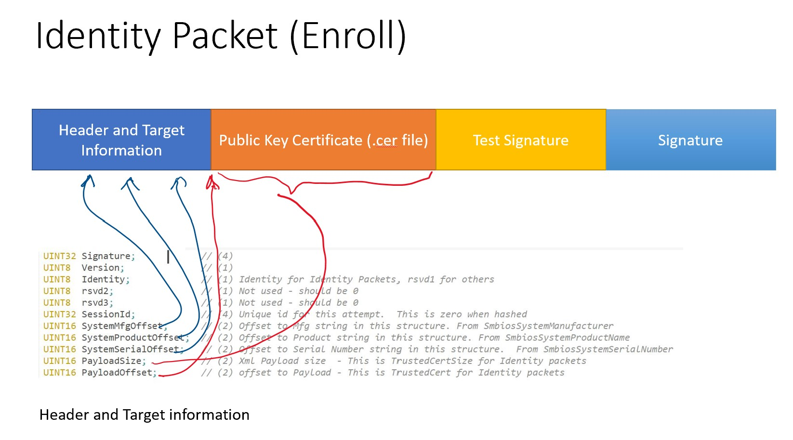
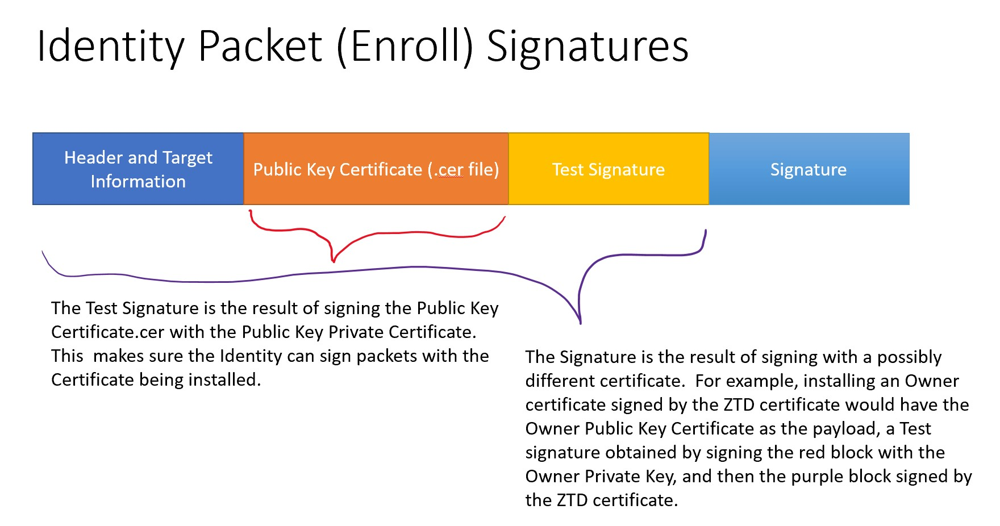
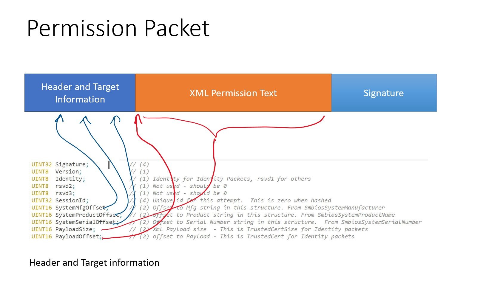
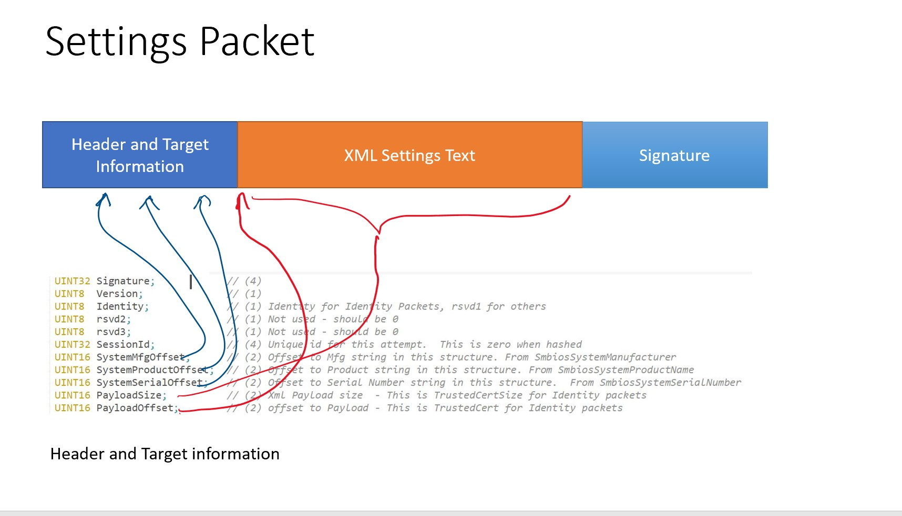

# DFCI Internals

This section describes the internal operations of DFCI.

## Communications with Provider

DFCI communicates with a controlling identity.  One of the controlling identities could be Microsoft Intune.  The communications path from the controlling identity is though the use of UEFI variables.  DFCI processes the mailbox variables during a system restart.

## Identity Manager

In the source code, the Identity manager is implemented in **IdentityAndAuthManager** is defined in the **DfciPkg** located in the **mu_plus** repository <https://github.com/microsoft/mu_plus/>.
Identity and Auth Manager is responsible for managing the Identities.
The initial state of the system has the Local User with full authentication to make changes to any of the available settings.
There are six Identities known by DFCI:

| Identity | Use of the Identity |
| --- | --- |
| Owner | The system owner. Used by a controlling agent - that authorizes Use to control some settings |
| User | A delegated user.  Used by Microsoft Intune.
| User1 | Not currently used |
| User2 | Not currently used |
| Local User | Not a certificate - just a known, default, user |
| Zero Touch | Limited use Identity to allow an Enroll from a controlling agent.  The system has the Zero Touch Certificate installed during manufacturing.  Zero Touch cannot be enrolled through the normal enroll operation. Zero Touch has no use when a system is enrolled. |

The Identity Manager reads the incoming mailbox to process a Identity enroll, Identity certificate update, and Identity unenroll operations.
Except for the Local User, when an Identity is enrolled, it means adding a Certificate that will be used to validate incoming settings.

The Identity Manager verifies that the incoming identity mailbox packet:

1. Is signed by one of the Identities
2. The signed identity has permission to update the target identity.
3. Target information in the packet matches the system information

The one exception is when an new Owner is being enrolled, no Identities validate the mailbox packet, and the Local User has permission to enroll an owner, DFCI will pause booting to prompt the Local User for permission to do the enroll.  The user will be asked to validate the enrollment by entering the last two characters of the new owners certificate hash.

When installed by the manufacturer of the system, the Zero Touch certificate will have permission to allow the Zero Touch owner packet to be enrolled without user intervention. Hence, the term Zero Touch enrollment.

## Permissions Manager

The permission manager processes incoming permission mailbox packets.  Permission packets must be signed by one of Owner, User, User1 or User2.  When processing the incoming permissions XML, the signer permissions are used to enable adding or changing a permission.  

## Settings Manager

The settings manager processes incoming settings mailbox packets.  Settings packets must be signed by one of Owner, User, User1 or User2.  When processing the incoming settings XML, the signer permissions are used to change a setting.  

## Identity Packet Formats

An Identity packet consists of a binary header, a DER encoded certificate file, a test signature validating the signing capability, and the signature of the packet:



The Test Signature is the detached signature of signing the public key certificate by the private key of the public key certificate. The Signature field of the packet is the detached signature of signing Header-PublicCert-TestSignature by:

| Operation | Signing Key |
| --- | --- |
| Enroll | The private key of the matching Public Key Certificate |
| Roll | The private key matching the public cert of the Identity being rolled.
| Unenroll | The private key matching the public cert of the Identity being unenrolled.



## Permission Packet Formats

A Permission packet consists of a binary header, an XML payload, and a signature:




Sample permission packet:

```xml
<?xml version="1.0" encoding="utf-8"?>
<PermissionsPacket xmlns="urn:UefiSettings-Schema">
    <CreatedBy>Cloud Controller</CreatedBy>
    <CreatedOn>2018-03-28</CreatedOn>
    <Version>1</Version>
    <LowestSupportedVersion>1</LowestSupportedVersion>
    <Permissions Default="129" Delegated="192" Append="False">
        <!--

           Sample DDS initial enroll permissions

           Permission Mask - 128 = Owner
                              64 = User
                              32 = User1
                              16 = User2
                               8 = ZTD
                               1 = Local User
           Owner keeps the following settings for itself
         -->
        <Permission>
            <Id>Dfci.OwnerKey.Enum</Id>
            <PMask>128</PMask>
            <DMask>128</DMask>
        </Permission>
        <Permission>
            <Id>Dfci.Recovery.Enable</Id>
            <PMask>128</PMask>
            <DMask>128</DMask>
        </Permission>
        <Permission>
            <!--
                   Needs 128 (Owner Permission) to set the key,
                   Needs  64 (User Permission) for User to roll the key
             -->
            <Id>Dfci.UserKey.Enum</Id>
            <PMask>192</PMask>
            <DMask>128</DMask>
        </Permission>
        <Permission>
            <Id>Dfci.RecoveryBootstrapUrl.String</Id>
            <PMask>128</PMask>
            <DMask>128</DMask>
        </Permission>
        <Permission>
            <Id>Dfci.RecoveryUrl.String</Id>
            <PMask>128</PMask>
            <DMask>128</DMask>
        </Permission>
        <Permission>
            <Id>Dfci.Hwid.String</Id>
            <PMask>128</PMask>
            <DMask>128</DMask>
        </Permission>
  </Permissions>
</PermissionsPacket>
```

## Settings Packet Formats




Sample settings payload:

```xml
<?xml version="1.0" encoding="utf-8"?>
<SettingsPacket xmlns="urn:UefiSettings-Schema">
    <CreatedBy>Mike Turner</CreatedBy>
    <CreatedOn>2019-03-06 10:10:00</CreatedOn>
    <Version>2</Version>
    <!--

      Make sure you edit DfciSettingsPattern.xml and then
      run BuildSettings.bat to generate the DfciSettings.xml

      -->
    <LowestSupportedVersion>2</LowestSupportedVersion>
    <Settings>
        <Setting>
            <Id>Dfci.RecoveryBootstrapUrl.String</Id>
            <Value>http://some URL to access recovery cert updates/</Value>
        </Setting>
        <Setting>
            <Id>Dfci.RecoveryUrl.String</Id>
            <Value>https://some URL to access recovery update packets/</Value>
        </Setting>
        <Setting>
            <Id>Dfci.HttpsCert.Binary</Id>
            <Value>
                <!--
                    This is where a BASE64 encoded string of the certificate used for HTTPS operations is stored.
                -->
                 wA==
            </Value>
        </Setting>
        <Setting>
            <Id>Dfci.RegistrationId.String</Id>
            <Value>
                12345678-1234-5678-1234-012345674321
            </Value>
        </Setting>
        <Setting>
            <Id>Dfci.TenantId.String</Id>
            <Value>
                98765432-1234-5678-1234-012345674321
            </Value>
        </Setting>
    </Settings>
</SettingsPacket>
```

## Packet Processing

In order to minimize rebooting when accepting packets from the owner, there are 6 mailboxes for DFCI.  There are two for each Identity, Permission, and Settings.  We call them:

1. Identity
2. Identity2
3. Permission
4. Permission2
5. Settings
6. Settings2

Only packets of the correct type are processed out of each mailbox.
Packets are processed in the following order:

1. Enroll Identity
2. Enroll Identity2
3. Apply Permission
4. Apply Permission2

    At this point, if there is a severe error, the Identities and Permissions are reverted to what they were before processing the packets. The following are still processed, in order.

5. Settings
6. Settings2
7. Unenroll Identity 2
8. Unenroll Identity

## UEFI CSP

Intune accesses the variables through the [UEFI CSP](https://docs.microsoft.com/en-us/windows/client-management/mdm/uefi-csp) provider.

## Out of band recovery

Normally, the cloud provider would just send unenroll packets through the OS to the UEFICsp.  However, if Windows is unable to boot, the UEFI front page application has a method to contact the owner via HTTPS.
